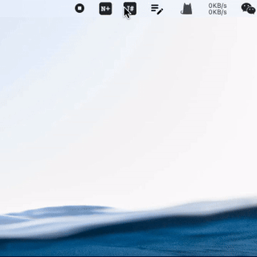
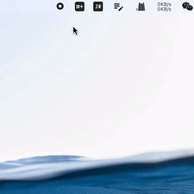
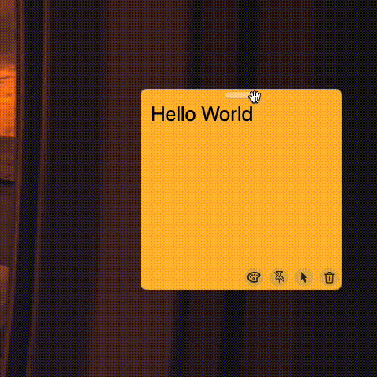
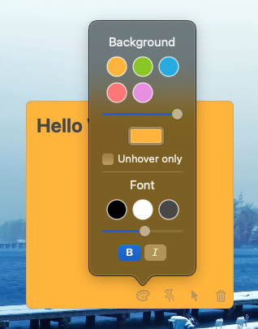

# DeskNote
A desk note app for macOS. Simple and useful.

## What's better?
1. Quick create new note via menubar
   
   
   

2. Auto hide when touch screen edges
   
   

3. Highly customize
   
   

## Relative libraries
- [Tray](https://github.com/boybeak/Tray) - Menubar tray support
- [WinDragger](https://github.com/boybeak/WinDragger) - Custom window dragger
- [WinToEdge](https://github.com/boybeak/WinToEdge) - Snap to screen edges